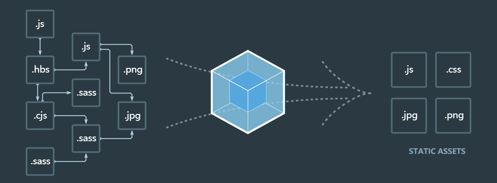
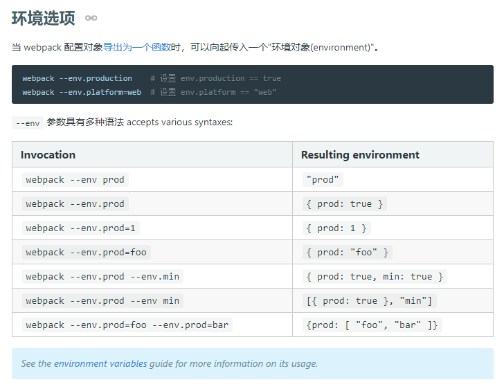
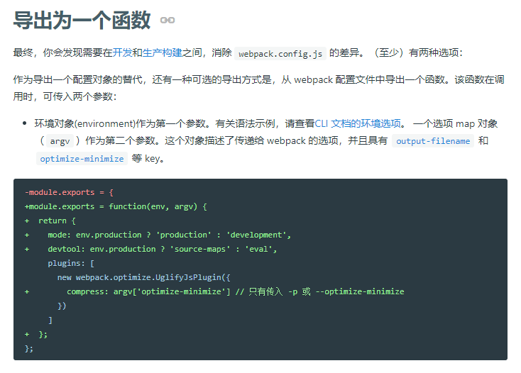

# 起步

## 在网页中会引用哪些常见的静态资源

1. 脚本文件: `js` `ts` `coffee` `jsx`;

2. 样式文件: `css` `less` `sass(scss)`;

3. 图片文件: `jpg` `png` `git` `bmp` `svg`;

4. 字体文件: `svg` `ttf` `eot` `woff` `woff2`;

5. 模板文件: `ejs` `jade` `vue`。

## 网页中引入的静态资源多了以后有什么问题？

1. 网页加载速度慢，发起很多二次请求;
2. 要处理错综复杂的依赖关系。

## 如何解决上述两个问题

1. 合并、压缩、精灵图、图片的base64编码;
2. 可以`requireJS`、也可以使用`webpack`解决各个包之间的复杂依赖关系。

## 什么是webpack？

前端的一个项目构建工具，基于`NodeJS`开发出来的一个前端工具。



## webpack 作用

1. 代码转换: TypeScript编译成JavaScript、SCSS编译成CSS等;

2. 文件优化: 压缩JavaScript、CSS、HTML代码，压缩合并图片等;

3. 代码分割: 提取多个页面的公共代码，提取首屏不需要执行的部分代码让其异步加载;

4. 模块合并: 在采用模块化的项目里会有很多个模块和文件，需要构建功能把模块分类合并成一个文件;

5. 自动刷新: 监听本地源代码的变化，自动重新构建、刷新浏览器;

6. 代码校验: 在代码被提交到仓库前需要校验代码是否符合规范，以及单元测试是否通过;

7. 自动发布: 更新完代码后，自动构建出线上发布代码并传输给发布系统。

这其中有两个核心:

1. 模块转换器(loader)，用于把模块原内容按照需求转换成新内容，可以加载非JS模块;

2. 扩展插件，在Webpack构建流程中的特定时机注入扩展逻辑来改变构建结果或做想要做的事情。

## webpack链接

1. [webpack官网](https://webpack.github.io/);

2. [webpack起步](https://www.webpackjs.com/guides/)。

## 安装方式

运行`npm i webpack -g`。运行`npm i webpack-cli -g`。

## 起步

1. `npm init -y`

-y是跳过简单设置，生成默认的package.json文件。

文件内容如下:

``` JS
{
    "name": "",
    "version": "1.0.0",
    "description": "",
    "main": "index.js",
    "scripts": {
        
    },
    "keywords": [],
    "author": "",
    "license": "ISC"
}
```

2. 安装`webpack`和`webpack-cli`(开发环境)

`npm install webpack webpack-cli -D`
或`npm install webpack webpack-cli --save-dev`。

3. 使用`npx webpack`

使用`npx`，就不用像使用`npm`那样，要在`package.json`的`scripts`中配置脚本命令，再使用`npm run`去跑，它可以直接使用。

`npx`会默认检查`/node_modules/.bin`路径下的和环境变量`$PATH`里面的命令去执行。

由于`npx`会检查环境变量`$PATH`，所以系统命令也可以调用，比如`npx ls`。

没有配置文件`webpack.config.js`时，默认输出成`/dist/main.js`文件。

使用`npx webpack --mode development`指定模式为开发模式，`production`为生产模式。

4. 使用`npm run`

为了简化加了参数的命令，还是要用`npm run`这种方式。在`package.json`文件中定义脚本命令: `"dev": "webpack --mode development"`和`"build": "webpack --mode production"`。这样子，我们就可以通过`npm run dev`和`npm run build`运行不同的脚本命令，区别不同模式了。`npm run`这个方式会把`/node_modules/.bin`路径下的命令放到全局上去跑。

5. 查看效果

我们可以在`dist`文件夹下新建`index.html`，并在其中引入`main.js`文件查看效果。

当前目录如下:

```
dist
    - main.js
    - index.html
node_modules
src
    - index.js
package-lock.json
package.json
```

6. webpack配置文件`webpack.config.js`、`webpack.file.js`

更多资料 -> [命令行接口](https://www.webpackjs.com/api/cli/) 和 [多种配置类型](https://www.webpackjs.com/configuration/configuration-types/) ;

一般使用时会根据开发与生产环境的不同，分为三块配置: 基本配置、开发配置、生产配置。

项目根目录下新建`build`文件夹，其下新建`webpack.base.js`、`webpack.dev.js`、`webpack.prod.js`。

在`package.json`的`scripts`下的脚本命令通过追加`--config webpack.base.js`参数，让两个环境的配置文件都指向基本配置文件。

然后脚本命令增加参数`--env.development`和`--env.production`区别不同环境。



在`webpack.base.js`中，使用导出为一个函数的形式，接收`env`，再通过`env.development`或`env.production`是否为真值，通过`webpack-merge`(`npm i -D webpack-merge`)，去合并对应配置的配置文件`webpack.dev.js`或`webpack.prod.js`。



7. 如果是开发环境，使用`webpack-dev-server`起服务

安装: `npm i webpack-dev-server -D`。

基本配置如下:

``` JS
// 在webpack.dev.js配置文件中新增devServer
devServer: {
    port: 8081, // 端口号
    compress: true, // gzip，提升返回页面的速度
    contentBase: path.resolve(__dirname, '../dist') // webpack启动服务会在dist目录下
}
```

此处要注意的是，通过`devServer`打包输出的文件(`bundle.js`)是存在于内存中的，即`/dist`文件夹下是没有这个文件的，但是`localhost:8081/bundle.js`是打的开的。

此时，有个缺点，我们要在`dist`目录下新建`index.html`文件，且可能要修改引入脚本的路径，我们希望的是，`src`下也有`index.html`文件，然后打包的时候打包进去`dist`并且自动修改引入的脚本路径。

8. 自动生成html文件并引入打包好的js(生成配置和开发配置都需要用到，所以在基本配置里面加)

安装: `npm i html-webpack-plugin -D`。

基本配置如下:

``` JS
// webpack.base.js配置文件
...
const HtmlWebpackPlugin = require('html-webpack-plugin');
...
module.exports = (env) => {
    let isDev = env.development;
    const base = {
        ...
        plugins: [
            new HtmlWebpackPlugin({
                template: path.resolve(__dirname, '../public/index.html'),
                filename: 'index.html',
                minify: !isDev && {
                    removeAttributeQuotes: true, // 去除属性的引号
                    collapseWhitespace: true // 压缩在一行
                }
            })
        ]
    }
    ...
}
```

通过这样的配置，它会帮我们以`public/index.html`为模板，打包生成`dist/index.html`并自动引入打包好的js。


